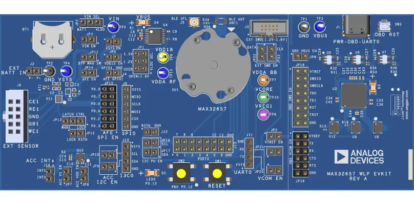

.. zephyr:board:: max32657evkit

MAX32657
########

Overview
********

The MAX32657 microcontroller (MCU) is an advanced system-on-chip (SoC)
featuring an Arm® Cortex®-M33 core with single-precision floating point unit (FPU)
with digital signal processing (DSP) instructions, large flash and SRAM memories,
and the latest generation Bluetooth® 5.4 Low Energy (LE) radio.
This device unites processing horsepower with the connectivity required for
continuous glucose monitoring (CGM), wearables, and other medical applications.
The nano-power modes increase battery life substantially.

The MAX32657 is qualified to operate at a temperature range of -20°C to +85°C,
ideal for medical environments.
Bluetooth 5.4 LE radio supports Mesh, long-range (coded), and high-throughput modes.
A cryptographic toolbox (CTB) provides advanced root of trust security features,
including an Advanced Encryption Standard (AES) Engine, TRNG, and secure boot.
TrustZone is also included in the M33 Core.
Many high-speed interfaces are supported on the device, including multiple SPI, UART,
and I3C/I2C serial interfaces.
All interfaces support efficient DMA-driven transfers between peripheral and memory.

The Zephyr port is running on the MAX32657 MCU.

Hardware
********

- MAX32657 MCU:

  - Arm Cortex-M33 CPU with TrustZone® and FPU
  - 1.2V to 1.6V Input Range for Integrated Boost DC-DC Converter
  - 50MHz Low Power Oscillator
  - External Crystal Support

    - 32MHz required for BLE

  - 1MB Internal Flash with ECC
  - 256kB Internal SRAM
  - 8kB Cache
  - 32.768kHz RTC external crystal

  - Typical Electrical Characteristics

    - ACTIVE: 50μA/MHz Arm Cortex-M33 Running Coremark (50MHz)

  - Bluetooth 5.4 LE Radio

    - Rx Sensitivity: -96dBm; Tx Power: +4.5dBm
    - 15mW Tx Power at 0dBm at 1.5Vin
    - 14mW Rx Power at 1.5Vin
    - Single-Ended Antenna Connection (50Ω)
    - Supports 802.15.4, and LE Audio
    - High-Throughput (2Mbps) Mode
    - Long-Range (125kbps and 500kbps) Modes

  - MBAN Radio (Medical Body Area Network)

    - Hardware and stack for Medical Body Area 2.36Ghz to 2.4GHz

  - Optimal Peripheral Mix Provides Platform Scalability

    - 2 DMA Controllers (Secure and non-Secure)
    - One SPI Controller/Peripheral
    - One I2C/I3C
    - 1 Low-Power UART (LPUART)
    - Six 32-Bit Low Power Timers with PWM
    - 14 Configurable GPIO with Internal Pullup/Pulldown Resistors

  - Cryptographic Tool Box (CTB) for IP/Data Security

    - True Random Number Generator (TRNG)
    - AES-128/192/256
    - Unique ID

  - Secure Boot ROM

Supported Features
==================

.. zephyr:board-supported-hw::

Connections and IOs
===================

+-----------+---------------+---------------+--------------------------------------------------------------------------------------------------+
| Name      | Name          | Settings      | Description                                                                                      |
+===========+===============+===============+==================================================================================================+
| JP1       | VDD12 SEL     |               |                                                                                                  |
|           |               | +-----------+ |  +-------------------------------------------------------------------------------+               |
|           |               | | 1-2       | |  | VDD12 User Selection.                                                         |               |
|           |               | +-----------+ |  +-------------------------------------------------------------------------------+               |
|           |               | | 3-4       | |  |  VDD12 AT 1.2 VOLTS.                                                          |               |
|           |               | +-----------+ |  +-------------------------------------------------------------------------------+               |
|           |               | | 5-6       | |  | VDD12 AT 1.5 VOLTS.                                                           |               |
|           |               | +-----------+ |  +-------------------------------------------------------------------------------+               |
|           |               | | Open      | |  |  VDD12 AT 1.6 VOLTS.                                                          |               |
|           |               | +-----------+ |  +-------------------------------------------------------------------------------+               |
|           |               |               |                                                                                                  |
+-----------+---------------+---------------+--------------------------------------------------------------------------------------------------+
| JP2       | VIN SEL       | +-----------+ |  +-------------------------------------------------------------------------------+               |
|           |               | | 1-2       | |  | VIN Powered from LDO.                                                         |               |
|           |               | +-----------+ |  +-------------------------------------------------------------------------------+               |
|           |               | | 2-3       | |  | VIN Powered from Battery                                                      |               |
|           |               | +-----------+ |  +-------------------------------------------------------------------------------+               |
|           |               |               |                                                                                                  |
+-----------+---------------+---------------+--------------------------------------------------------------------------------------------------+
| JP3       | VIN EN        | +-----------+ |  +-------------------------------------------------------------------------------+               |
|           |               | | 1-2       | |  | Default for normal operation.                                                 |               |
|           |               | +-----------+ |  +-------------------------------------------------------------------------------+               |
|           |               | | Open      | |  | Open jumper to measure load current.                                          |               |
|           |               | +-----------+ |  +-------------------------------------------------------------------------------+               |
|           |               |               |                                                                                                  |
+-----------+---------------+---------------+--------------------------------------------------------------------------------------------------+
| JP4       | VDD12 EN      | +-----------+ |  +-------------------------------------------------------------------------------+               |
|           |               | | 1-2       | |  | Default for normal operation.                                                 |               |
|           |               | +-----------+ |  +-------------------------------------------------------------------------------+               |
|           |               | | Open      | |  | Open jumper to measure load current.                                          |               |
|           |               | +-----------+ |  +-------------------------------------------------------------------------------+               |
|           |               |               |                                                                                                  |
+-----------+---------------+---------------+--------------------------------------------------------------------------------------------------+
| JP5       | VTREF EN      | +-----------+ |  +-------------------------------------------------------------------------------+               |
|           |               | | 1-2       | |  | Enable OBD Section Reference Voltage.                                         |               |
|           |               | +-----------+ |  +-------------------------------------------------------------------------------+               |
|           |               | | Open      | |  | Disable OBD Section Reference Voltage.                                        |               |
|           |               | +-----------+ |  +-------------------------------------------------------------------------------+               |
|           |               |               |                                                                                                  |
+-----------+---------------+---------------+--------------------------------------------------------------------------------------------------+
| JP6       | OBD VBUS EN   | +-----------+ |  +-------------------------------------------------------------------------------+               |
|           |               | | 1-2       | |  | Enable OBD Power Regulators.                                                  |               |
|           |               | +-----------+ |  +-------------------------------------------------------------------------------+               |
|           |               | | Open      | |  | Disable OBD Power Regulators.                                                 |               |
|           |               | +-----------+ |  +-------------------------------------------------------------------------------+               |
|           |               |               |                                                                                                  |
+-----------+---------------+---------------+--------------------------------------------------------------------------------------------------+
| JP7       | ACC VS E      | +-----------+ |  +-------------------------------------------------------------------------------+               |
|           |               | | 1-2       | |  | Default for normal operation (Accelerometer VS Power).                        |               |
|           |               | +-----------+ |  +-------------------------------------------------------------------------------+               |
|           |               | | Open      | |  | Open jumper to measure load current.                                          |               |
|           |               | +-----------+ |  +-------------------------------------------------------------------------------+               |
|           |               |               |                                                                                                  |
+-----------+---------------+---------------+--------------------------------------------------------------------------------------------------+
| JP8       | ACC VDD EN    | +-----------+ |  +-------------------------------------------------------------------------------+               |
|           |               | | 1-2       | |  | Default for normal operation (Accelerometer VDD Power).                       |               |
|           |               | +-----------+ |  +-------------------------------------------------------------------------------+               |
|           |               | | Open      | |  | Open jumper to measure load current.                                          |               |
|           |               | +-----------+ |  +-------------------------------------------------------------------------------+               |
|           |               |               |                                                                                                  |
+-----------+---------------+---------------+--------------------------------------------------------------------------------------------------+
| JP9       | ACC I2C EN    | +-----------+ |  +-------------------------------------------------------------------------------+               |
|           |               | | 1-2       | |  | Accelerometer SDA Pin is connected to DUT I2C0_SDA.                           |               |
|           |               | +-----------+ |  +-------------------------------------------------------------------------------+               |
|           |               | | Open      | |  | Accelerometer SDA Pin is disconnected from DUT I2C0_SDA.                      |               |
|           |               | +-----------+ |  +-------------------------------------------------------------------------------+               |
|           |               |               |                                                                                                  |
+-----------+---------------+---------------+--------------------------------------------------------------------------------------------------+
| JP10      | ACC I2C EN    | +-----------+ |  +-------------------------------------------------------------------------------+               |
|           |               | | 1-2       | |  | Accelerometer SCL Pin is connected to DUT I2C0_SCL.                           |               |
|           |               | +-----------+ |  +-------------------------------------------------------------------------------+               |
|           |               | | Open      | |  | Accelerometer SCL Pin is disconnected from DUT I2C0_SCL.                      |               |
|           |               | +-----------+ |  +-------------------------------------------------------------------------------+               |
|           |               |               |                                                                                                  |
+-----------+---------------+---------------+--------------------------------------------------------------------------------------------------+
| JP11      | BYP MAG SW    | +-----------+ |  +-------------------------------------------------------------------------------+               |
|           |               | | 1-2       | |  | Bypass Magnetic Switch.                                                       |               |
|           |               | +-----------+ |  +-------------------------------------------------------------------------------+               |
|           |               | | Open      | |  | Open jumper to distrubute the power through the Magnetic Switch.              |               |
|           |               | +-----------+ |  +-------------------------------------------------------------------------------+               |
|           |               |               |                                                                                                  |
+-----------+---------------+---------------+--------------------------------------------------------------------------------------------------+
| JP12      | LOCK RSTN     | +-----------+ |  +-------------------------------------------------------------------------------+               |
|           |               | | 1-2       | |  | AFE Lock Pin is connected to DUT RSTN Pin.                                    |               |
|           |               | +-----------+ |  +-------------------------------------------------------------------------------+               |
|           |               | | Open      | |  | AFE Lock Pin is disconnected from DUT RSTN Pin.                               |               |
|           |               | +-----------+ |  +-------------------------------------------------------------------------------+               |
|           |               |               |                                                                                                  |
+-----------+---------------+---------------+--------------------------------------------------------------------------------------------------+
| JP13      | LATCH CTRL    | +-----------+ |  +-------------------------------------------------------------------------------+               |
|           |               | | 1-2       | |  | AFE LOCK Pin Control the Latch Input of the TMR Switch.                       |               |
|           |               | +-----------+ |  +-------------------------------------------------------------------------------+               |
|           |               | | 2-3       | |  | AFE WAKE Pin Control the Latch Input of the TMR Switch.                       |               |
|           |               | +-----------+ |  +-------------------------------------------------------------------------------+               |
|           |               |               |                                                                                                  |
+-----------+---------------+---------------+--------------------------------------------------------------------------------------------------+
| JP14      | AFE EN        | +-----------+ |  +-------------------------------------------------------------------------------+               |
|           |               | | 1-2       | |  | Default for normal operation (AFE VBAT Power).                                |               |
|           |               | +-----------+ |  +-------------------------------------------------------------------------------+               |
|           |               | | Open      | |  | Open jumper to measure load current.                                          |               |
|           |               | +-----------+ |  +-------------------------------------------------------------------------------+               |
|           |               |               |                                                                                                  |
+-----------+---------------+---------------+--------------------------------------------------------------------------------------------------+
| JP15      | AFE SPI EN    | +-----------+ |  +-------------------------------------------------------------------------------+               |
|           |               | | 1-2       | |  | AFE CS is connected to DUT SPI0_CS0.                                          |               |
|           |               | +-----------+ |  +-------------------------------------------------------------------------------+               |
|           |               | | 3-4       | |  | AFE SDI is connected to DUT SPI0_MOSI.                                        |               |
|           |               | +-----------+ |  +-------------------------------------------------------------------------------+               |
|           |               | | 5-6       | |  | AFE SCLK is connected to DUT SPI0_SCK.                                        |               |
|           |               | +-----------+ |  +-------------------------------------------------------------------------------+               |
|           |               | | 7-8       | |  | AFE SDO is connected to DUT SPI0_MISO.                                        |               |
|           |               | +-----------+ |  +-------------------------------------------------------------------------------+               |
|           |               | | 9-10      | |  | AFE INTB is connected to DUT P0.7.                                            |               |
|           |               | +-----------+ |  +-------------------------------------------------------------------------------+               |
|           |               | | Open All  | |  | Disconnect SPI Interface From DUT.                                            |               |
|           |               | +-----------+ |  +-------------------------------------------------------------------------------+               |
|           |               | | 11-12     | |  | AFE GPIO2 is connected to DUT P0.8.                                           |               |
|           |               | +-----------+ |  +-------------------------------------------------------------------------------+               |
|           |               |               |                                                                                                  |
+-----------+---------------+---------------+--------------------------------------------------------------------------------------------------+
| JP16      | I2C PU EN     | +-----------+ |  +-------------------------------------------------------------------------------+               |
|           |               | | 1-2       | |  | Enable SCL PU resistor.                                                       |               |
|           |               | +-----------+ |  +-------------------------------------------------------------------------------+               |
|           |               | | Open      | |  | Disable SCL PU resistor.                                                      |               |
|           |               | +-----------+ |  +-------------------------------------------------------------------------------+               |
|           |               |               |                                                                                                  |
+-----------+---------------+---------------+--------------------------------------------------------------------------------------------------+
| JP17      | I2C PU EN     | +-----------+ |  +-------------------------------------------------------------------------------+               |
|           |               | | 1-2       | |  | Enable SDA PU resistor.                                                       |               |
|           |               | +-----------+ |  +-------------------------------------------------------------------------------+               |
|           |               | | Open      | |  | Disable SDA PU resistor.                                                      |               |
|           |               | +-----------+ |  +-------------------------------------------------------------------------------+               |
|           |               |               |                                                                                                  |
+-----------+---------------+---------------+--------------------------------------------------------------------------------------------------+
| JP18      | OBD SWD EN    | +-----------+ |  +-------------------------------------------------------------------------------+               |
|           |               | | 3-4       | |  | OBD SWDIO is connected to the DUT SWDIO.                                      |               |
|           |               | +-----------+ |  +-------------------------------------------------------------------------------+               |
|           |               | | 5-6       | |  | OBD SWCLK is connected to the DUT SWCLK.                                      |               |
|           |               | +-----------+ |  +-------------------------------------------------------------------------------+               |
|           |               | | 7-8       | |  | OBD JTAG TDO Enable Jumper (It's not used on MAX32657).                       |               |
|           |               | +-----------+ |  +-------------------------------------------------------------------------------+               |
|           |               | | 9-10      | |  | OBD JTAG TDI Enable Jumper (It's not used on MAX32657).                       |               |
|           |               | +-----------+ |  +-------------------------------------------------------------------------------+               |
|           |               | | 11-12     | |  | OBD RSTN is connected to the DUT RSTN.                                        |               |
|           |               | +-----------+ |  +-------------------------------------------------------------------------------+               |
|           |               | | 13-14     | |  | OBD JTAG TRST Enable Jumper (It's not used on MAX32657).                      |               |
|           |               | +-----------+ |  +-------------------------------------------------------------------------------+               |
|           |               | | Open All  | |  | Disable OBD SWD Connection from DUT.                                          |               |
|           |               | +-----------+ |  +-------------------------------------------------------------------------------+               |
|           |               |               |                                                                                                  |
+-----------+---------------+---------------+--------------------------------------------------------------------------------------------------+
| JP19      | OBD VCOM EN   | +-----------+ |  +-------------------------------------------------------------------------------+               |
|           |               | | 3-4       | |  | OBD VCOM TXD is connected VCOM EN  RX Jumper.                                 |               |
|           |               | +-----------+ |  +-------------------------------------------------------------------------------+               |
|           |               | | 5-6       | |  | OBD VCOM RXD is connected VCOM EN  TX Jumper.                                 |               |
|           |               | +-----------+ |  +-------------------------------------------------------------------------------+               |
|           |               | | 7-8       | |  | OBD VCOM CTS Enable Jumper (It's not used on MAX32657).                       |               |
|           |               | +-----------+ |  +-------------------------------------------------------------------------------+               |
|           |               | | 9-10      | |  | OBD VCOM RTS Enable Jumper (It's not used on MAX32657).                       |               |
|           |               | +-----------+ |  +-------------------------------------------------------------------------------+               |
|           |               | | Open      | |  | Disable OBD VCOM Connection from DUT.                                         |               |
|           |               | +-----------+ |  +-------------------------------------------------------------------------------+               |
|           |               |               |                                                                                                  |
+-----------+---------------+---------------+--------------------------------------------------------------------------------------------------+
| JP20      | VCOM EN       | +-----------+ |  +-------------------------------------------------------------------------------+               |
|           |               | | 1-2       | |  | Connects OBD VCOM RXD to the DUT UART0A_TX.                                   |               |
|           |               | +-----------+ |  +-------------------------------------------------------------------------------+               |
|           |               | | Open      | |  | Disable OBD VCOM RXD.                                                         |               |
|           |               | +-----------+ |  +-------------------------------------------------------------------------------+               |
|           |               |               |                                                                                                  |
+-----------+---------------+---------------+--------------------------------------------------------------------------------------------------+
| JP21      | VCOM EN       | +-----------+ |  +-------------------------------------------------------------------------------+               |
|           |               | | 1-2       | |  | Connects OBD VCOM TXD to the DUT UART0A_RX.                                   |               |
|           |               | +-----------+ |  +-------------------------------------------------------------------------------+               |
|           |               | | Open      | |  | Disable OBD VCOM TXD.                                                         |               |
|           |               | +-----------+ |  +-------------------------------------------------------------------------------+               |
|           |               |               |                                                                                                  |
+-----------+---------------+---------------+--------------------------------------------------------------------------------------------------+
| JP22      | EXT SWD EN    | +-----------+ |  +-------------------------------------------------------------------------------+               |
|           |               | | 1-2       | |  | Connects EXT SWD Connector Data Signals to the DUT SWDIO Pin.                 |               |
|           |               | +-----------+ |  +-------------------------------------------------------------------------------+               |
|           |               | | Open      | |  | Disable EXT SWD Data Connection.                                              |               |
|           |               | +-----------+ |  +-------------------------------------------------------------------------------+               |
|           |               |               |                                                                                                  |
+-----------+---------------+---------------+--------------------------------------------------------------------------------------------------+
| JP23      | EXT SWD EN    | +-----------+ |  +-------------------------------------------------------------------------------+               |
|           |               | | 1-2       | |  | Connects EXT SWD Connector Clock Signals to the DUT SWDCLK Pin.               |               |
|           |               | +-----------+ |  +-------------------------------------------------------------------------------+               |
|           |               | | Open      | |  | Disable EXT SWD Clock Connection.                                             |               |
|           |               | +-----------+ |  +-------------------------------------------------------------------------------+               |
|           |               |               |                                                                                                  |
+-----------+---------------+---------------+--------------------------------------------------------------------------------------------------+

Zephyr board options
********************

The MAX32657 microcontroller (MCU) is an advanced system-on-chip (SoC)
featuring an ARM Cortex-M33 architecture that provides Trustzone technology
which allow define secure and non-secure application.
Zephyr provides support for building for both Secure and Non-Secure firmware.

The BOARD options are summarized below:

+-------------------------------+-------------------------------------------+
| BOARD                         | Description                               |
+===============================+===========================================+
| max32657evkit/max32657        | For building Trust Zone Disabled firmware |
+-------------------------------+-------------------------------------------+
| max32657evkit/max32657/ns     | For building Non-Secure firmware          |
+-------------------------------+-------------------------------------------+

BOARD: max32657evkit/max32657
=============================

Build the zephyr app for max32657evkit/max32657 board will generate secure firmware
for zephyr. In this configuration 960KB of flash is used to store the code and 64KB
is used for storage section. In this mode tf-m is off and secure mode flag is on
``:kconfig:option:CONFIG_TRUSTED_EXECUTION_SECURE=y`` and
``:kconfig:option:CONFIG_BUILD_WITH_TFM=n``

+----------+------------------+---------------------------------+
| Name     | Address[Size]    | Comment                         |
+==========+==================+=================================+
| slot0    | 0x1000000[960k]  | Secure zephyr image             |
+----------+------------------+---------------------------------+
| storage  | 0x10f0000[64k]   | File system, persistent storage |
+----------+------------------+---------------------------------+

Here are the instructions to build zephyr with a non-secure configuration,
using :zephyr:code-sample:`blinky` sample:

.. zephyr-app-commands::
   :zephyr-app: samples/basic/blinky/
   :board: max32657evkit/max32657
   :goals: build

Programming and Debugging
*************************

.. zephyr:board-supported-runners::

Flashing
========

Here is an example for the :zephyr:code-sample:`hello_world` application. This example uses the
:ref:`jlink-debug-host-tools` as default.

.. zephyr-app-commands::
   :zephyr-app: samples/hello_world
   :board: max32657evkit/max32657
   :goals: flash

Open a serial terminal, reset the board (press the RESET button), and you should
see the following message in the terminal:

.. code-block:: console

   ***** Booting Zephyr OS build v4.1.0 *****
   Hello World! max32657evkit/max32657

Debugging
=========

Here is an example for the :zephyr:code-sample:`hello_world` application. This example uses the
:ref:`jlink-debug-host-tools` as default.

.. zephyr-app-commands::
   :zephyr-app: samples/hello_world
   :board: max32657evkit/max32657
   :goals: debug

Open a serial terminal, step through the application in your debugger, and you
should see the following message in the terminal:

.. code-block:: console

   ***** Booting Zephyr OS build v4.1.0 *****
   Hello World! max32657evkit/max32657

References
**********

.. _1:
   https://developer.arm.com/documentation/100935/0100/The-TrustZone-hardware-architecture-
